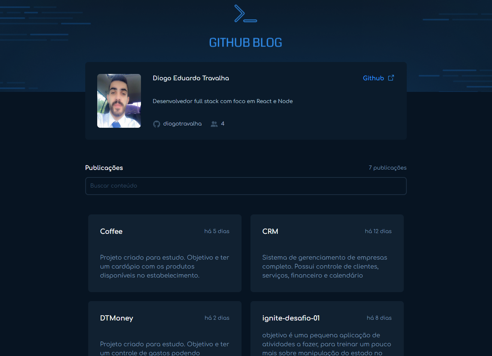

# 🚀 GitBlog

Projeto criado para estudo. Objetivo criar um blog com os repositorios do github.

# 🧠 Contexto

Funcionalidades:

- [ ] Consumindo Api do Github com axios
- [ ] lib react-hook-form

## 📋 Tecnologias

- React.js
- Typescript
- Tailwindcss

## ✏️ Feito por Diogo Travalha
